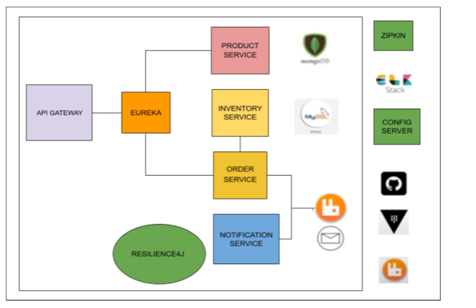

# INT_3310_microservice
Microservice server for log monitoring ELK demonstration

# Microservice system overview
 
This is a simple Springboot microservice system. The main purpose of this system is to demonstrate logging these services combined with ELK and distribute tracing with Zipkin, hence each service contains no complex business domain and only perform basic CRUD operation 
5 services included in ELK and Zipkin are:
* API-gateway
* Product Service
* Inventory Service
* Order Service
* Notification Service

# Environment
## Overall
* RabbitMQ
* ELK (From home page <a ref="https://www.elastic.co/what-is/elk-stack">here</a>)
* Zipkin
* Postman
* Sleuth and Zipkin
## Product Service
* MongoDB (as a service)
## Order Service
* MySQL
## Inventory Service
* MySQL
<i> This repository only provide code, to understand the process and how to setup and run please watch <a href="https://www.youtube.com/playlist?list=PLSVW22jAG8pDY3lXXEv1hKVIAlnJ9nDN_">this tutorial</a></i> 
I've modified the code slightly to demonstrate some features of ELK and Zipkin in some particular scenario! 

# Experiment
## ELK dashboard
